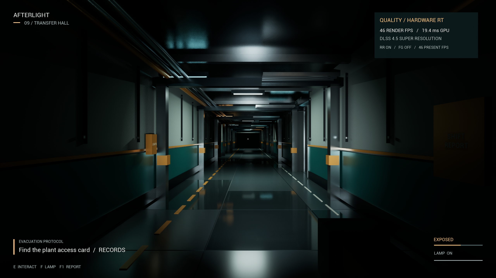

# AFTERLIGHT

**Every light has a price.**

A first-person escape horror game set in a sealed underground facility. Recover the night supervisor's access card, repair auxiliary power, vent the coolant and call the surface lift. A rigid maintenance automaton follows light and noise. Switch lights off, isolate room circuits or permanently break fixtures to hide your route.

Built in Unreal Engine 5.8.2 for Windows / DirectX 12, with a low-poly industrial style and rigid block-built characters. This project requires hardware ray tracing.



Windows **0.2.0** adds a three-room playable introduction and smooth, per-frame Warden locomotion. The body keeps its rigid Lego-like pose; visible movement is no longer locked to the AI's ten-updates-per-second thinking loop. See [validation and measured performance](docs/VALIDATION.md).

Before the original transfer hall, a **30–60-second total orientation** teaches controls through the actual environment:

1. **Arrival:** WASD/mouse, then E at the check-in panel; warm area lights and soft shadows.
2. **Light lab:** F reveals colored room lighting, E cuts the circuit for a true blackout, F restores the handheld beam, and LMB breaks a marked fixture; real shadow-casting grille and calibration dummy.
3. **Service gallery:** moving mirror/floor reflections, Ctrl under a physical low pipe, Shift to sprint and E to enter the main hall.

The Warden stays inactive throughout the introduction. Entering the hall starts a fresh grace period, and retry restores the introductory rooms. There is no time limit; take longer to inspect the lighting if you like. F1–F4 use the game controls without also triggering Unreal debug views.

## Play

On this development machine:

```powershell
.\Scripts\Play.ps1
```

When a packaged build exists, this launches `Builds\Windows\Afterlight.exe`. Otherwise it runs the native game through Unreal. Press **Enter** to begin. The editor host map is intentionally empty: `AFacility::Build` constructs the full environment when play starts.

The Windows package runs without Unreal Editor installed. Keep its `Engine` and `Afterlight` folders beside `Afterlight.exe`. If Windows reports a missing Visual C++ runtime, install the included `Engine\Extras\Redist\en-us\vc_redist.x64.exe`. The first launch may pause briefly while the driver creates ray-tracing pipelines.

| Control | Action |
| --- | --- |
| WASD / mouse | Walk / look |
| E | Use equipment, collect items, switch a fixture or breaker |
| F | Toggle handheld light |
| Left mouse | Break the aimed light within 4.6 metres |
| Shift / Ctrl | Run / crouch |
| Esc / Enter | Pause / resume |
| F1 | Read the shift report and objective hints |
| F2 | Cycle Quality, Smooth and Showcase rendering |
| F3 | Toggle supported 2x DLSS Frame Generation |
| F4 | Show render FPS, GPU time and presentation FPS |
| F6 | Freeze the scene and hide the HUD; press again to resume |
| [ / ] | Adjust mouse sensitivity |
| R | Restart from pause or an ending |
| Q | Quit from a menu or ending |

## Build from source

Install UE **5.8.2**, Visual Studio's C++ game development tools and a Windows SDK. Install NVIDIA's official **DLSS 4.5 UE 5.8 plugin package** into the engine's `Engine\Plugins\Marketplace` folder. This project uses DLSS, StreamlineDLSSG and StreamlineReflex plus their supplied dependencies. Tested installed package: **8.7.2 / NGX 310.6.0 / Streamline 2.11.1**.

[Download official NVIDIA plugins](https://developer.nvidia.com/rtx/dlss). Proprietary Unreal and NVIDIA source/binaries are not included in this repository.

```powershell
.\Scripts\Build.ps1 -Target Editor
# Assets are committed. Regenerate them only when modifying their source recipe:
.\Scripts\GenerateAssets.ps1
.\Scripts\Build.ps1 -Target Package
.\Scripts\Bundle.ps1
```

The scripts accept `-EngineRoot` when Unreal is installed elsewhere. No global npm packages or external art dependencies are needed. Sounds are original procedural synthesis; their reproducible recipe is in `Scripts/GenerateAssets.py`.

## Rendering

MegaLights provides hardware-ray-traced area-light visibility and direct shadows. Hardware Lumen supplies GI and hit-lit reflections. DLSS Super Resolution, Ray Reconstruction and Reflex are enabled through NVIDIA's capability-checked native APIs. The 4070 Super supports ordinary 2x Frame Generation; 50-series multi-frame modes are not offered on it.

There are no baked lights, skylights, sunlight or unshadowed fill lights. Screen-space light/GI/reflection fallback is disabled. Every physical mesh batch casts shadows and remains in the ray tracing scene. All fixtures, their emissive diffusers and the handheld lamp can go dark. The small opaque geometry budget leaves GPU time for lighting.

The renderer still uses rasterized primary visibility, denoising and temporal reconstruction. It is not advertised as a fully path-traced game. See [rendering decisions](docs/RENDERING.md) for the precise implementation and official sources.

For higher real-frame rates, select **Smooth** with F2. **Quality** prioritizes the internal image resolution; **Showcase** uses native-resolution DLAA and hit lighting for both GI and reflections. F3 adds supported 2x Frame Generation. Frame Generation automatically suspends when the game loses foreground focus.

## Validation and target hardware

Target: i7-14700K, **16 GB RAM**, RTX 4070 Super 12 GB. At 1440p, the current 0.2.0 packaged Quality benchmark measures approximately **48 rendered FPS**; the short Smooth hallway sample measures approximately **58 FPS**. Foreground 2x Frame Generation measures **85 presented FPS** from **42 rendered FPS** in a short stationary sample. These are distinct measurements, not minimum-FPS guarantees. The original 60-rendered-FPS Quality target has **not** been reached. See [measurement scopes and limitations](docs/VALIDATION.md).

The available validation machine is an i7-14700F with **32 GB** and an RTX 4070 Super. Its memory usage can be measured, but it cannot prove testing on an exact 16 GB configuration.

```powershell
.\Scripts\Audit.ps1
.\Scripts\Audit.ps1 -Packaged
.\Scripts\Audit.ps1 -Packaged -NoRayTracing
.\Scripts\Audit.ps1 -Packaged -OrientationOnly
# Focus the game window when prompted; the focused test allows five minutes:
.\Scripts\Audit.ps1 -Packaged -FrameGenerationOnly
```

The audit launches an explicitly visible game window; click it and keep it in the foreground until the test exits without pressing keys. It writes screenshots and a JSON report under the running project's `Saved\Evidence`. The current package passes **36 orientation/locomotion checks**, **64 main-facility checks including actual FG**, and **2 non-RT refusal checks**. The introductory route uses real movement without teleports and takes **31.5 seconds** with brief viewing pauses; the Warden moves on **126 of 126 sampled render frames**. Main-facility integration separately checks the complete shadow contract, blackout, irreversible destruction, physical movement and doors, bound inputs, every mission prerequisite, both endings, enemy perception/navigation, actual level reload and settings persistence. Its camera benchmarks exclude transitions and shader warm-up and bypass the intro. See [current committed evidence and testing limitations](docs/VALIDATION.md).
