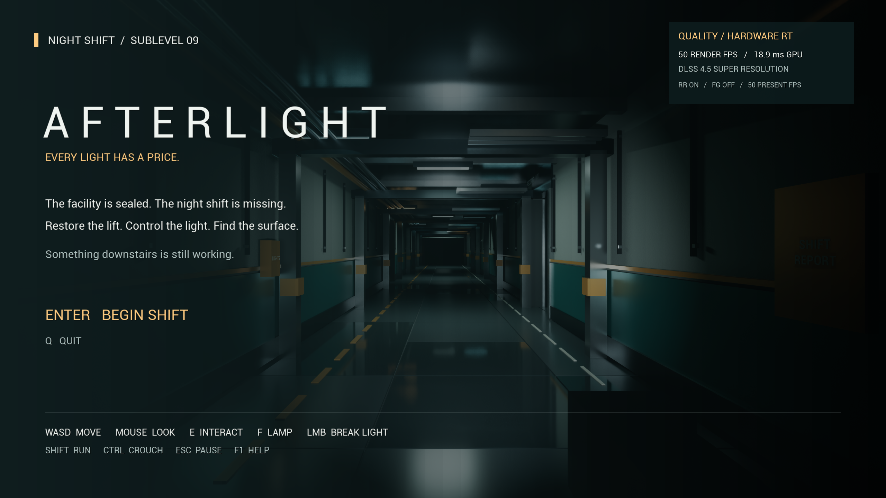
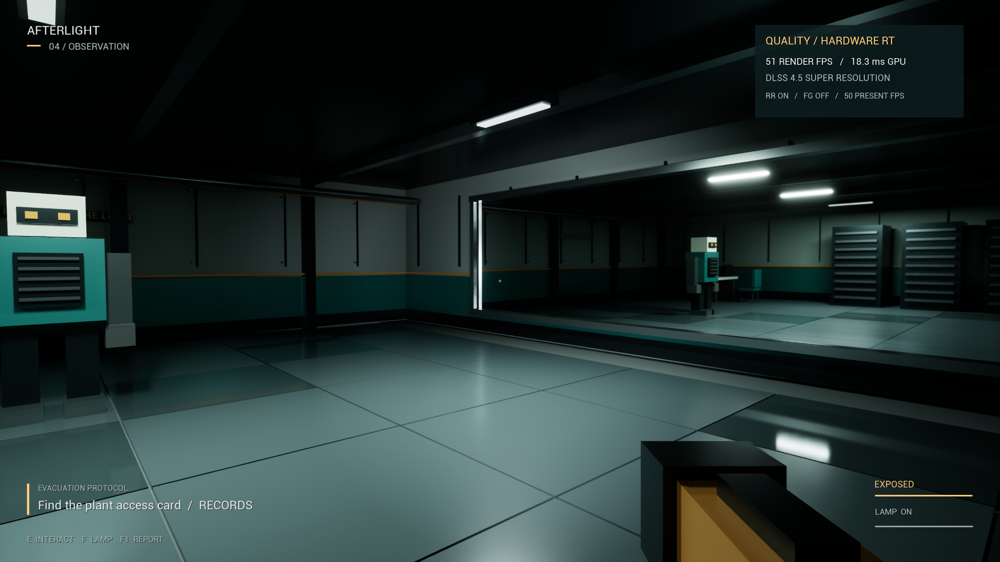
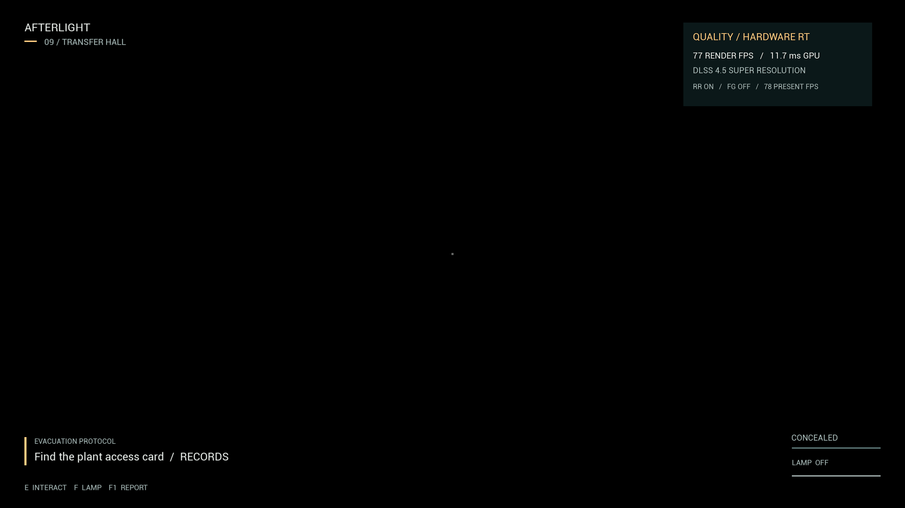
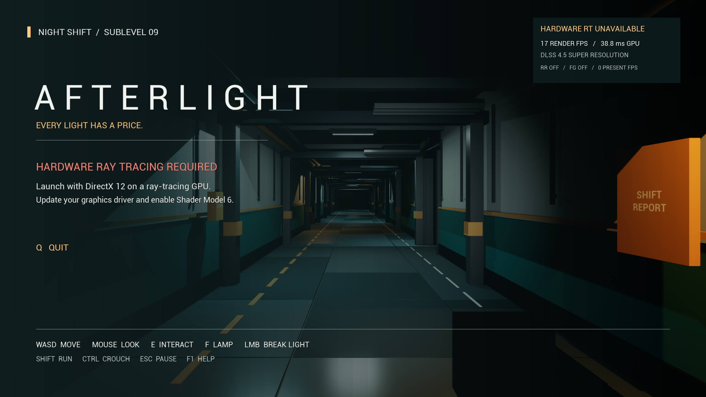

# Packaged build validation

Measured on 2026-09-05 with the Win64 Development package built from this repository. This is a playable 0.1.0 escape-horror prototype, with one outstanding foreground Frame Generation validation step.

## Results

- Editor and game C++ targets compile successfully. Asset generation, cooking and packaging succeed; the final cook reports zero errors and zero warnings.
- The packaged integration audit passes **62 checks** covering rendering, light control, mission progression, movement, enemy behavior, capture, escape and actual level reload.
- **Two checks fail in this background session:** native foreground focus during the FG sample, and actual additional frames from FG. The complete audit therefore correctly records `passed: false`; it is not a clean all-green result.
- A separate packaged launch with `-noraytracing` passes **both refusal checks**. Enter cannot bypass the ray-tracing requirement.
- The sampled physical memory peak is **2263 MiB / 2.21 GiB for the game process**. This is not total system memory or VRAM usage.

Raw reports: [runtime integration](evidence/runtime-audit.json), [non-RT refusal](evidence/no-rt-audit.json).

Local standalone archive: `Builds/AFTERLIGHT-Win64-0.1.0.zip` (**485,526,467 bytes**). SHA-256: `47479af3a971144d9945fff9567fe913b68dacb8606dd20f869c4089378b78df`. The archive was checked for the launcher, game executable and Visual C++ redistributable; it contains no saved games, logs or PDB debug symbols. It stays local; proprietary engine/plugin binaries are not pushed to the source repository.

## Hardware and measured performance

Validation machine: Intel Core i7-14700F, 31.84 GiB installed memory, RTX 4070 Super 12 GB, NVIDIA driver 610.47, Windows 11. Engine: UE 5.8.2, CL 56702186. Output: **2560 × 1440**. DLSS plugin: 8.7.2, NGX 310.6.0, Streamline 2.11.1.

| Mode | Rendered FPS | Measurement scope |
| --- | ---: | --- |
| Quality / DLSS Quality / FG off | **53.21** | Five fixed cameras, 1066 frames / about 20 seconds |
| Smooth / DLSS Balanced / FG off | **63.70** | Three-second stationary hallway sample |
| Showcase / native DLAA / FG off | **20.56** | Three-second stationary hallway sample |

Quality mean frame time: **18.79 ms**; p95: **19.87 ms**; p99: **20.16 ms**. The fixed cameras sample the transfer hall, Records, Workshop, Plant and Pump Room. Shader warm-up, camera transitions and screenshot readback are excluded; AI is frozen during these samples. The short preset comparisons are **not** equivalent multi-room benchmarks or minimum-FPS guarantees.

The original 60-rendered-FPS Quality target has not been reached with full internal-resolution reflections retained. Smooth provides a faster option while keeping all hardware-ray-traced lighting features. Showcase deliberately spends substantially more GPU time on native resolution and lighting quality. Exact i7-14700K / 16 GB testing, long-duration frame pacing and peak dedicated VRAM remain unverified.

## Frame Generation: remaining verification

The 4070 Super reports support for ordinary 2x FG. The game uses NVIDIA's real API, passes depth/motion/HUD-less buffers, enables Reflex and selects one generated frame. A detailed SDK trace reports `DLSS-G disabled: window not focused` in this test environment. Windows declined the game's foreground request, and the Computer Use native connection was unavailable.

All **154** FG samples had no native foreground focus and no additional generated frames. The recorded 51.15 presentation FPS versus 51.35 render FPS is therefore **not an FG speedup**; the tiny difference is the SDK's smoothing window. No engine focus override or fabricated FPS multiplier is used.

Run the focused test on an interactive desktop:

```powershell
.\Scripts\Audit.ps1 -Packaged -FrameGenerationOnly
```

Click the AFTERLIGHT window and leave it in the foreground. The test allows five minutes to acquire actual focus, warms the FG sample, measures real generated-frame counts, writes `Saved\Evidence\frame-generation-audit.json` beneath the packaged game and exits. A pass requires every measured sample to be focused, more than 30 samples with additional generated frames, and presentation FPS above 1.45 times render FPS. After this passes, rerun the full packaged audit in the foreground before declaring all integration gates complete.

## What the gameplay audit exercises

This is scripted integration testing, not a human playthrough. It teleports between mission stations and uses real first-person aim/interaction traces. Separate input tests press W, Shift, Ctrl, E, F and the mouse strike binding, checking physical movement, solid-wall collision, doorway traversal, stamina, crouch, fixture switches, destruction, room breakers and the handheld lamp. Every room-navigation edge is swept with a player-sized capsule after unlocking.

The mission checks reject missing prerequisites, acquire the card and fuse, unlock the Plant, install the fuse, vent pressure, run the actual 35-second lift countdown and enter the exit. Enemy checks exercise darkness concealment, torch detection, wall occlusion, lost pursuit, hearing, doorway navigation and physical capture. An actual map reload restores mission equipment and lights, preserves user settings, and initializes walking through a fresh possession.

Rendering checks cover hardware RT, DLSS SR/RR, raw reflection inputs, MegaLights, hardware Lumen, disabled screen-space lighting fallbacks, every light and mesh's shadow/RT participation, Nanite surface data and exact full-triangle fallback geometry. Blackout and restored lighting are captured after temporal settling.

## Captured visuals

These are unedited screenshots produced by the packaged game, not concept images or offline renders.









Further limitations: keyboard/mouse only, one compact facility, procedural audio, no mid-run saves, no manual human playtest in this session. The renderer uses rasterized primary visibility with ray-traced lighting and temporal reconstruction; it is not full path tracing. See [the rendering contract](RENDERING.md).
