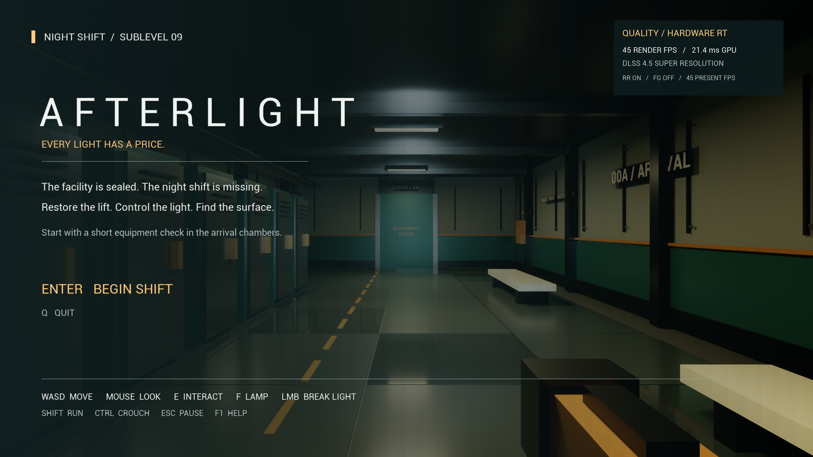
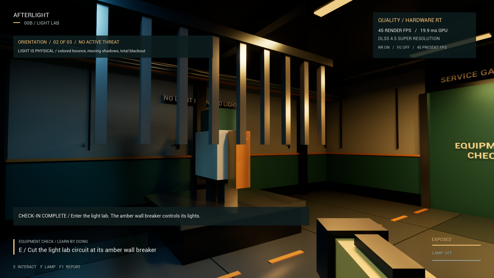
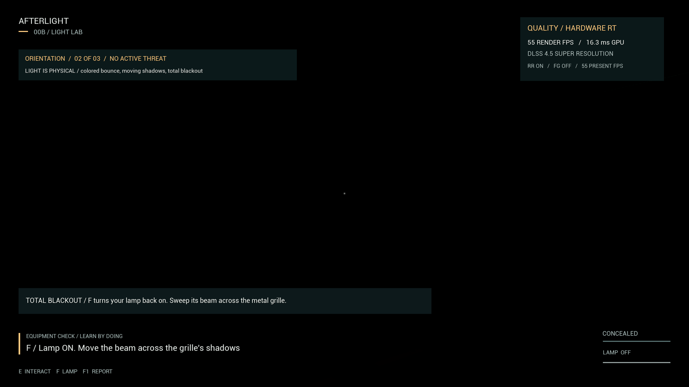
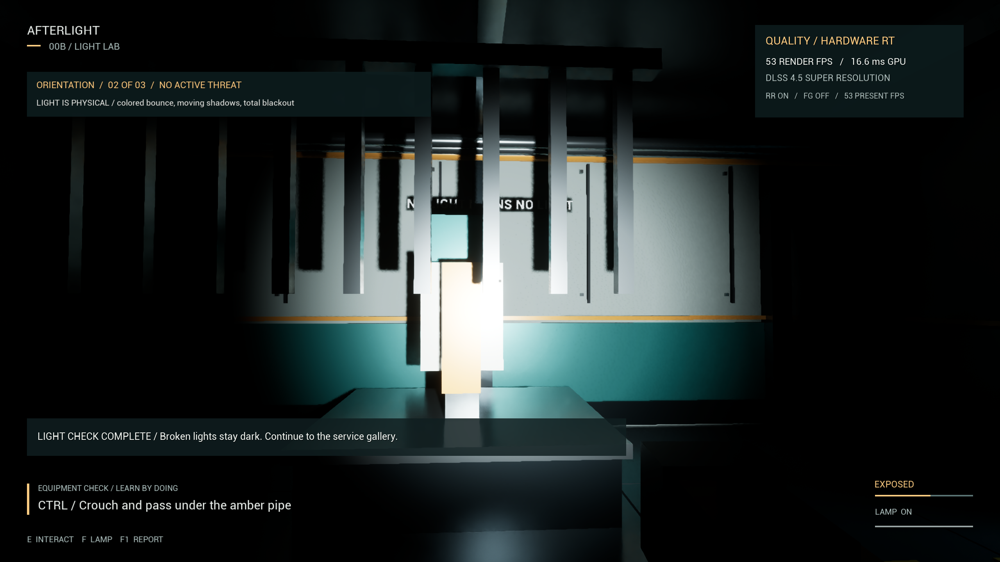
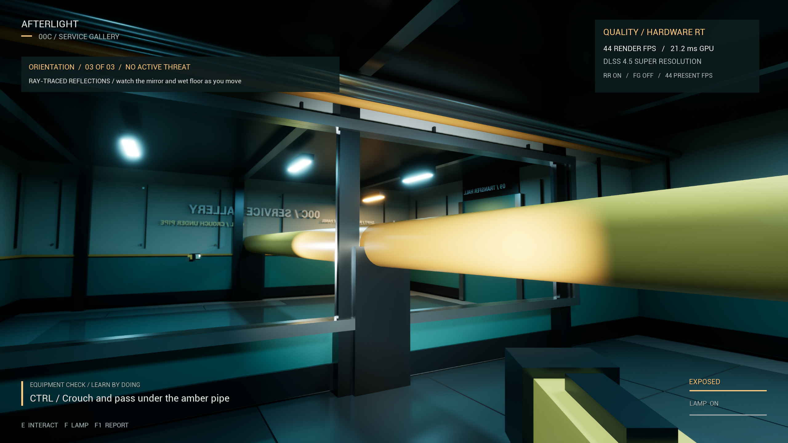

# Packaged build validation

Validated on 2026-09-06 UTC (September 5 locally) with the Win64 Development **0.2.0** package. This version adds the three-room playable orientation and smooth, per-frame Warden movement while retaining its rigid body pose.

## Current results

| Packaged audit | Report time (UTC) | Result |
| --- | --- | --- |
| Orientation rooms and smooth Warden locomotion | 00:55:45 | **36 passed, zero failed** |
| Main-facility integration, including actual foreground FG | 01:02:41 | **64 passed, zero failed** |
| Non-RT refusal | 01:03:26 | **2 passed, zero failed** |

The editor and game C++ targets compile, and cooking, staging and packaging succeed. All six PowerShell scripts parse successfully. The orientation audit also confirms that inherited Unreal debug shortcuts are absent from the actual packaged PlayerInput.

Raw current reports: [orientation and locomotion](evidence/orientation-audit.json), [main-facility integration](evidence/runtime-audit.json), [non-RT refusal](evidence/no-rt-audit.json).

## Orientation and enemy movement

The guided route physically walks through Arrival, the Light Lab and the Service Gallery in **31.50 seconds**, within the 30–60-second total pacing target. It uses the actual Enter, W, E, F, LMB, Ctrl and Shift bindings, real aim traces, physical doors and the crouched player capsule. There are **no teleports during the introduction**. Brief viewing pauses and screenshot readback are included in its elapsed gameplay time; the initial title-screen warm-up is excluded. This is a scripted guided route, not a timed first-time human playthrough or an FPS benchmark. Players can take longer; there is no time limit.

Checks prove that the Warden is inactive during orientation, the light-lab entrance seals for blackout, the breaker cuts the real circuit, the handheld light can restore visibility, the test fixture stays broken, crouching passes under the physical pipe, sprinting registers actual movement, and the final panel releases the original hall. Entering the hall seals the intro, extinguishes its rooms and starts a fresh enemy grace period.

The Warden changes position on **126 of 126 sampled render frames** during a roughly two-second live patrol sample; the largest frame displacement is **2.08 cm**. Separate deterministic checks cover equal distance at **30, 60 and 120 Hz**, continuous travel across waypoints, swept closed-door collision and pause. These checks demonstrate that locomotion is no longer quantized to the 10 Hz AI thinking loop; they do not establish long-duration frame pacing.

An actual map reload resets every orientation lesson, restores all three gates, circuits and the broken training light, and respawns a walking player in Arrival.

## Standalone package

Current archive: `Builds/AFTERLIGHT-Win64-0.2.0.zip` (**485,546,639 bytes**).

- Archive SHA-256: `7cdf71a6e78121a5bbf84df13c15d908e2b3fccb942d10a3fa7921f07c5b073e`
- Game executable SHA-256: `5b94c64f1ac14f06a695be0ca8e5e9d497b683ed01c66b6cb18084690c2f957f`
- All **62 archived files** match both the tested `Builds/Windows` package and the clean staging tree byte-for-byte using SHA-256.
- The public launcher, real game executable and Visual C++ redistributable are included; saved data, logs and PDB symbols are excluded.

Older 0.1.0 archives remain locally for recovery but do not include the new rooms or movement fix. Proprietary engine/plugin binaries are not pushed to the source repository.

## Hardware and measured performance

Validation machine: Intel Core i7-14700F, 31.84 GiB installed memory, RTX 4070 Super 12 GB, NVIDIA driver 610.47, Windows 11. Engine: UE 5.8.2, CL 56702186. Output: **2560 × 1440**. DLSS plugin: 8.7.2, NGX 310.6.0, Streamline 2.11.1.

| Mode | Rendered FPS | Measurement scope |
| --- | ---: | --- |
| Quality / DLSS Quality / FG off | **47.50** | Five fixed cameras, 949 frames / about 20 seconds |
| Smooth / DLSS Balanced / FG off | **57.68** | Three-second stationary hallway sample |
| Showcase / native DLAA / FG off | **19.55** | Three-second stationary hallway sample |

Quality mean frame time: **21.05 ms**; p95: **22.46 ms**; p99: **23.11 ms**. The fixed cameras sample the transfer hall, Records, Workshop, Plant and Pump Room. Shader warm-up, camera transitions and screenshot readback are excluded; AI is frozen during these samples. The legacy main-facility audit explicitly bypasses the new introduction to retain its established test route. Intro traversal is tested separately, not included in this camera benchmark. The short preset comparisons are **not** equivalent multi-room benchmarks or minimum-FPS guarantees.

The original 60-rendered-FPS Quality target has not been reached with full internal-resolution reflections retained. Smooth provides a faster option while keeping all hardware-ray-traced lighting features. Showcase spends substantially more GPU time on native resolution and lighting quality. Exact i7-14700K / 16 GB testing, long-duration frame pacing and peak dedicated VRAM remain unverified.

Sampled peak physical memory for the **game process** is **2218 MiB / 2.17 GiB** in the full audit and **2221 MiB / 2.17 GiB** in the orientation audit. The non-RT refusal process peaks at **3089 MiB / 3.02 GiB**. These are not total system memory or VRAM figures.

## Frame Generation: verified in the foreground

The current full integration run measures **42.48 rendered FPS / 84.54 presented FPS**, with additional generated frames and actual foreground focus on **127 of 127 samples**. The roughly three-second stationary hallway sample follows warm-up and precedes screenshot readback. NVIDIA's real SDK reports presentation timing and generated-frame counts; no engine focus override or fabricated render-FPS multiplier is used.

The 4070 Super uses ordinary 2x FG. FG overhead reduces base render throughput; presented FPS is not simulation or input-sampling FPS. This is not a long-duration pacing test or multi-room FG benchmark.

To repeat the focused test:

```powershell
.\Scripts\Audit.ps1 -Packaged -FrameGenerationOnly
```

Click the AFTERLIGHT window and leave it in the foreground. The focused mode allows five minutes to acquire actual focus. A pass requires every measured sample to be focused, more than 30 samples with additional generated frames, and presentation FPS above 1.45 times render FPS.

The separately retained [focused FG report](evidence/frame-generation-audit.json) and [input-refresh smoke report](evidence/controls-smoke.json) are **historical 0.1.0 evidence**, not current 0.2.0 measurements. Current FG proof is in the full runtime report linked above.

## What the main-game audit exercises

This is scripted integration testing, not a human playthrough. It teleports between main-facility mission stations and uses real first-person aim/interaction traces. Separate input tests check walking, solid-wall collision, doorway traversal, stamina, crouch, fixture switches, destruction, room breakers and the handheld lamp. Every room-navigation edge is swept with a player-sized capsule after unlocking.

Mission checks reject missing prerequisites, acquire the card and fuse, unlock the Plant, install the fuse, vent pressure, run the actual 35-second lift countdown and enter the exit. Enemy checks exercise darkness concealment, torch detection, wall occlusion, lost pursuit, hearing, doorway navigation and physical capture. An actual map reload restores mission equipment and lights, preserves user settings and initializes walking through a fresh possession.

Rendering checks cover hardware RT, DLSS SR/RR, raw reflection inputs, MegaLights, hardware Lumen, disabled screen-space lighting fallbacks, all **41 fixtures**, every physical mesh's shadow/RT participation, Nanite surface data and full-triangle fallback geometry. Blackout and restored lighting are captured after temporal settling. The `-noraytracing` launch displays a refusal screen, and Enter cannot bypass it.

## Captured visuals

These are unedited screenshots produced by the current packaged game, not concept images or offline renders. All five orientation captures were visually inspected.












Further limitations: keyboard/mouse only, one compact facility, procedural audio, no mid-run saves, and no complete manual human playtest in this session. The renderer uses rasterized primary visibility with ray-traced lighting and temporal reconstruction; it is not full path tracing. See [the rendering contract](RENDERING.md).
